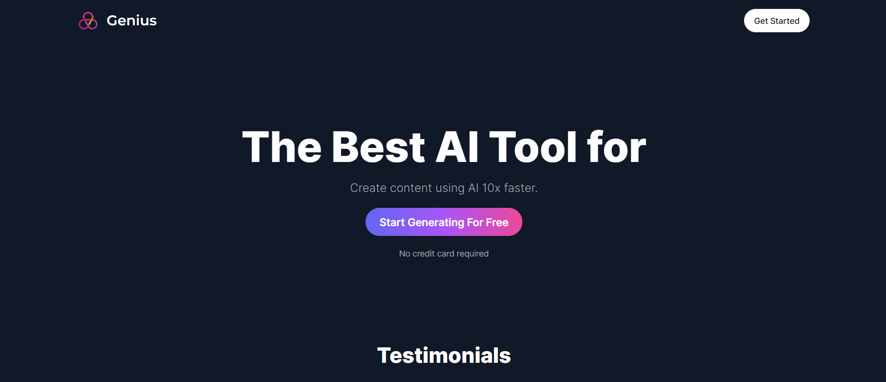

# AI SaaS Platform

AI-powered SaaS application built with Next.js and OpenAI API.

## Tech Stack

* Next.js 13
* React
* TypeScript
* OpenAI API
* Stripe
* Tailwind CSS

## Features

* AI text generation
* Subscription payment system
* User-friendly dashboard
* Responsive UI
* API integration

## Overview

This project is a SaaS platform that provides AI-powered text generation features.

Users can:

* Generate AI content
* Manage subscriptions
* Access premium features
* Interact with AI services

## Technical Highlights

* OpenAI API integration
* Stripe payment processing
* Server-side rendering with Next.js
* Type-safe development with TypeScript

## Screenshots

### HOME

### AI Result

## Known Issues

Some AI-related features may be limited depending on API usage restrictions.

## Project Status

This project is mainly for portfolio and technical demonstration.

Some pages or third-party service features may not be fully available in the deployed version due to environment variables, API keys, database connection, authentication settings, or free-tier service limitations.

The source code, project structure, and main implementation are available in this repository.